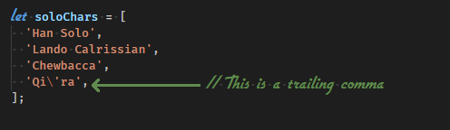
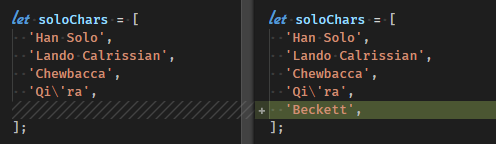
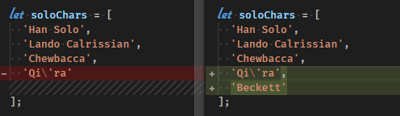

## Trailing Commas

This website was made to show the benefits of using trailing commas!

### What is a Trailing?

A trailing comma is when you use a comma at the end of the last line of an object or array when programming. Sometimes it is called a "final comma." Trailing commas have always been allowed in JavaScript.

### Why should I use trailing commas?
1. Clean diffs in code merges with less code changed. Also makes reading pull requests easy.
1. You don't have to add more commas when you add more code! Frustrated with going up a line after adding a new element, save your future-self the trouble by adding it ahead of time.

Here is a merge with a trailing comma:

Here is the same merge without a trailing comma:

As you can see, it's much easier to read the merge when using trailing commas.